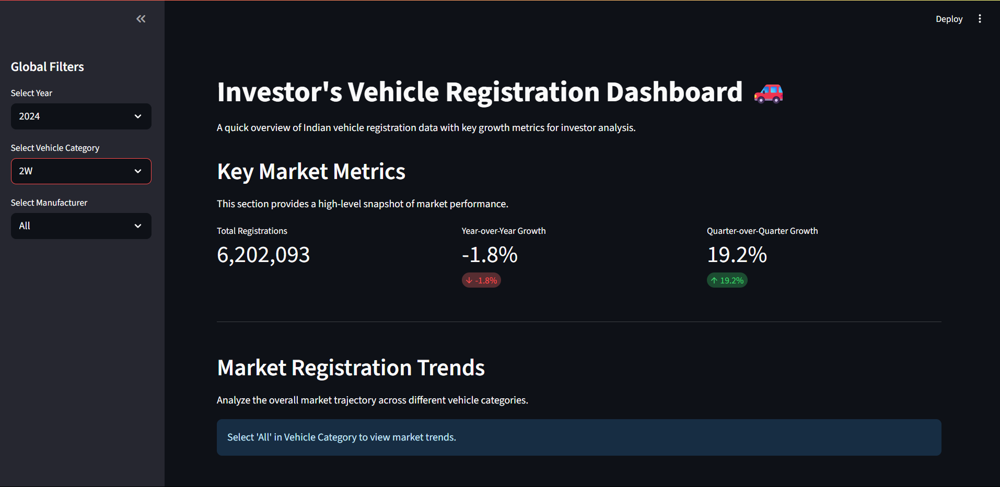
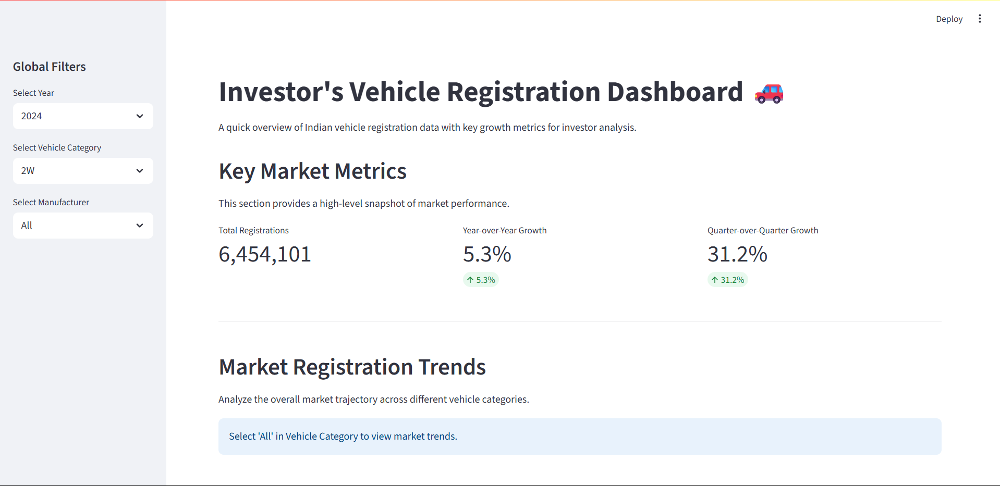

# Investor's Vehicle Registration Dashboard

An interactive and investor-focused dashboard built with **Streamlit** to analyze **vehicle registration data in India**. This tool transforms raw registration figures into **actionable insights**, offering KPIs and dynamic visualizations for **Year-over-Year (YoY)** and **Quarter-over-Quarter (QoQ)** growth.

---

## 📊 Key Features

- **🔎 Global Filters**  
  Filter data by **year**, **vehicle category** (2W, 3W, 4W), and **manufacturer**. All dashboard components dynamically update based on selections.

- **📈 Key Performance Indicators (KPIs)**  
  Quickly view:
  - Total registrations
  - YoY growth %
  - QoQ growth %

- **📉 Market Trends Analysis**  
  Line chart showing quarterly registration trends by vehicle category for the selected year.

- **🏭 Manufacturer Deep-Dive**  
  Bar charts showing YoY and QoQ growth for manufacturers within a selected category.

- **📱 Responsive UI**  
  Optimized for both **desktop** and **mobile** viewing with a modern dark theme.

---
## 📸 Screenshots



---



---


---


---

---


---

---


---

## 🛠 Setup Instructions

### ✅ Requirements

- Python 3.9+
- pip

### Clone the Repository

```bash
git clone https://github.com/[your-username]/my_dashboard_project.git
cd my_dashboard_project

```


### Create a Virtual Environment

```bash
python -m venv venv
# macOS/Linux
source venv/bin/activate
# Windows
venv\Scripts\activate
```

###  Install Dependencies
```bash
pip install -r requirements.txt
```

### 🚀 How to Run
▶️ Local Execution
```bash
streamlit run app.py
```
#### Open http://localhost:8501 in your browser.

### 🐳 Docker Execution
1. Build Docker Image
```bash
docker build -t streamlit-dashboard .
```
2. Run Docker Container
```bash
docker run -p 8501:8501 streamlit-dashboard
```
#### Visit: http://localhost:8501

---

## 📂 Data Assumptions
- The project uses mock data generated in data_processing.py

- Data simulates: Years: 2023, 2024 and Quarters: Q1 to Q4

- Vehicle categories: 2W (Two-Wheelers), 3W (Three-Wheelers), 4W (Four-Wheelers)

- Major manufacturers in each category

- In production, the mock data can be replaced with real data from the Vahan Public Dashboard via web scraping.

---

## 💡 Bonus Investor Insight
⚡ Electric Vehicles (EVs) are rapidly gaining traction in new registrations, despite their small overall share in total vehicles. This suggests:

---

### A strong inflection point

- Huge investment potential in:

- EV manufacturing

- Charging infrastructure

---

## Battery R&D

### 🔮 Feature Roadmap
- ✅ Replace mock data with live data scraping from the Vahan dashboard

- 🔁 Integrate with a relational database (e.g., SQLite)

- 🤖 Add machine learning models to forecast registration trends

- 🧩 Add advanced filters (e.g., by fuel type or RTO region)

---

## 👤 Author
- Pranav Jarande
- pranavjarande27@gmail.com

---